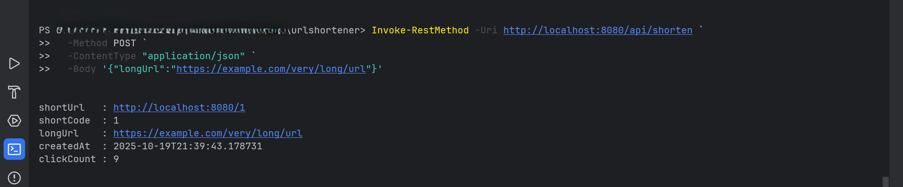
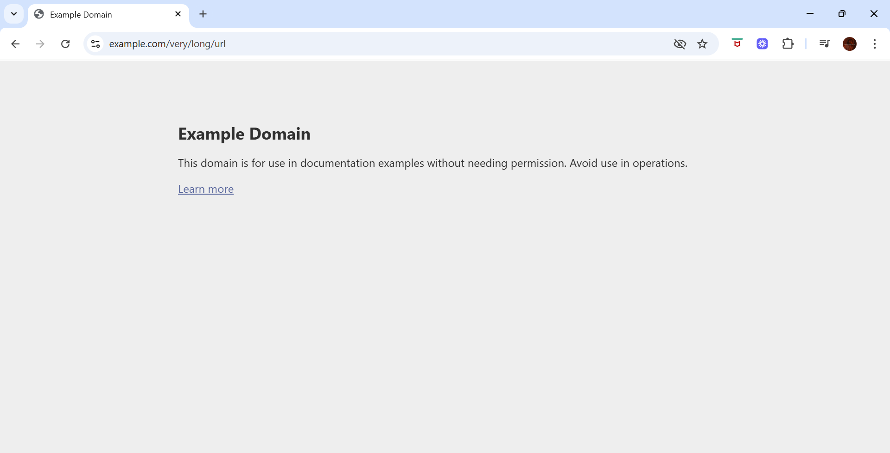
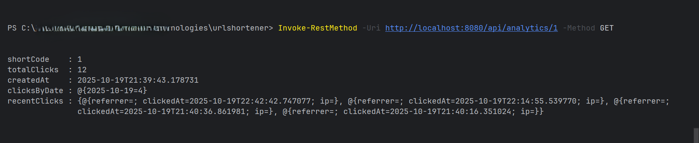

# URL Shortener Service

A URL Shortener built with Spring Boot and MySQL that allows users to convert long URLs into short, easy-to-share links and track their usage with analytics.
> **Internship Project** - Developed as part of the CodeC Technologies Internship Program.

---

## Table of Contents

- [Project Overview](#project-overview)
- [Features](#features)
- [Technologies Used](#technologies-used)
- [Setup Instructions](#setup-instructions)
- [API Endpoints](#api-endpoints)
- [Testing the Project](#testing-the-project)
- [Project Structure](#project-structure)
- [Screenshots / Example](#screenshots--example)
- [License](#license)

---

## Project Overview

This project is a simple URL Shortener system:

- Users can submit a long URL to generate a short URL.
- When the short URL is visited, the system redirects to the original long URL.
- The system tracks clicks and provides analytics like total clicks and creation date.

---

## Features

- Shorten long URLs
- Redirect to original URLs via short URLs
- Track number of clicks per URL
- Analytics endpoint for usage statistics
- Simple REST API

---

## Technologies Used

| Technology        | Purpose                                  |
|------------------|------------------------------------------|
| Java              | Programming language                     |
| Spring Boot       | Backend framework for building REST APIs |
| MySQL             | Database to store URLs and clicks        |
| Spring Data JPA   | ORM to interact with database            |
| PowerShell        | Script to test API endpoints             |
| Invoke-RestMethod | Native PowerShell HTTP requests          |
| Lombok            | Reduce boilerplate code (optional)       |

---

## Setup Instructions

1. **Clone the repository**
```
git clone <your-repo-link>
cd urlshortener
```

2. **Create MySQL Database**
```
CREATE DATABASE urlshortener_db;
```

3. **Configure applocation.properties**
```
spring.datasource.url=jdbc:mysql://localhost:3306/urlshortener_db?useSSL=false&serverTimezone=UTC
spring.datasource.username=root
spring.datasource.password=YOUR_PASSWORD

spring.jpa.hibernate.ddl-auto=update
spring.jpa.show-sql=true
spring.jpa.properties.hibernate.dialect=org.hibernate.dialect.MySQL8Dialect

server.port=8080
```
> Replace `YOUR_PASSWORD` with your MySQL password.

4. **Build and run the Spring Boot app**
```
mvn spring-boot:run
```
The backend will run on: `http://localhost:8080`

--- 

### API Endpoints

| Endpoint                     | Method | Description                              |
|-------------------------------|--------|------------------------------------------|
| `/api/shorten`                | POST   | Submit long URL to generate short URL    |
| `/api/analytics/{shortCode}`  | GET    | Get analytics for a specific short URL   |
| `/{shortCode}`                | GET    | Visit the short URL → redirects to original long URL |

---

## Testing the Project (PowerShell)

You can test your URL Shortener API using `Invoke-RestMethod` in PowerShell.

### 1️⃣ Shorten a Long URL

```
Invoke-RestMethod -Uri http://localhost:8080/api/shorten `
  -Method POST `
  -ContentType "application/json" `
  -Body '{"longUrl":"https://example.com/very/long/url"}'
```

### Response Example: Shorten a Long URL
```
shortUrl   : http://localhost:8080/1
shortCode  : 1
longUrl    : https://example.com/very/long/url
createdAt  : 2025-10-19T21:39:43.178731
clickCount : 0
```

### 2️⃣ Visit the Short URL (simulate click)
```
Invoke-RestMethod -Uri http://localhost:8080/1 -Method GET
```
- Visiting the short URL will redirect to the original long URL.
- Each visit increments the click count.

### 3️⃣ Fetch Analytics for a Short URL
```
Invoke-RestMethod -Uri http://localhost:8080/api/analytics/1 -Method GET
```
### Response Example:
```
shortCode   : 1
longUrl     : https://example.com/very/long/url
createdAt   : 2025-10-19T21:39:43.178731
clickCount  : 1
clicks      : {@{timestamp=2025-10-19T22:10:55.4206024}}
```
- clickCount → total visits
- clicks → array of individual click timestamps

### 4️⃣ Test Script in One Shot
You can also run a PowerShell script (test-urlshortener.ps1) that does all three steps automatically:
```
.\test-urlshortener.ps1
```
It will:
- Shorten a long URL
- Simulate visiting the short URL
- Fetch and display analytics

---

### Project Structure

```
urlshortener/
├── src/
│   ├── main/java/com/example/urlshortener/
│   │   ├── controller/       # REST API controllers
│   │   ├── service/          # Business logic
│   │   ├── repository/       # JPA Repositories
│   │   ├── model/            # Entity classes (Url, Click)
│   │   ├── dto/              # Data Transfer Objects
│   │   ├── exception/        # Custom exceptions
│   │   └── util/             # Utility classes (Base62 encoder)
│   └── resources/
│       ├── application.properties
│       └── static/index.html
├── src/test/java/com/example/urlshortener/  # Unit and controller tests
├── pom.xml
├── README.md
└── test-urlshortener.ps1  # PowerShell test script
```

---

## 🖼️ Screenshots

All screenshots are in the `uploads/` folder. Example usage in markdown:

### Short URL Creation


### Redirect via Short URL


### Analytics / Click Count


---

### License
This project is open-source and free to use for learning or personal projects.

---

##  Authors

**Bibi Amina**  
**MCA Student | Aspiring Full Stack Developer & Data Analyst**
